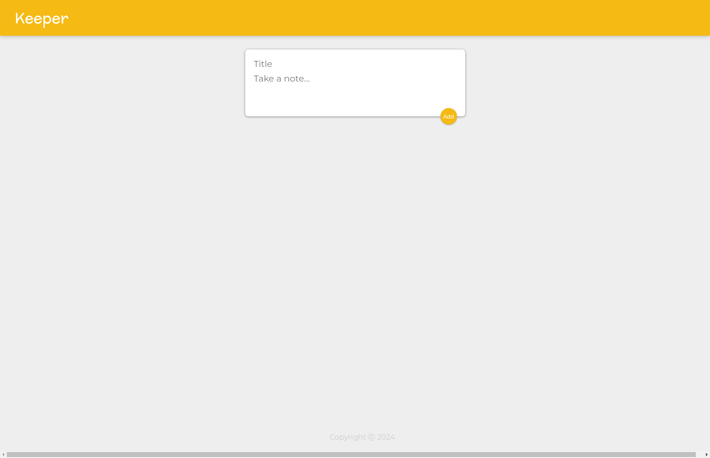

# Keeper App

Live Demo: [https://keeper-app-website-76yrz2de.devinapps.com](https://keeper-app-website-76yrz2de.devinapps.com)

## Overview
Keeper is a note-taking application built with React that allows users to create and manage notes with titles and content.

## Screenshot

## Features
- Create notes with title and content
- Clean and intuitive user interface
- Responsive design

## Development
This project was originally created on StackBlitz: [Edit on StackBlitz ⚡️](https://stackblitz.com/edit/react-qghqzt)
